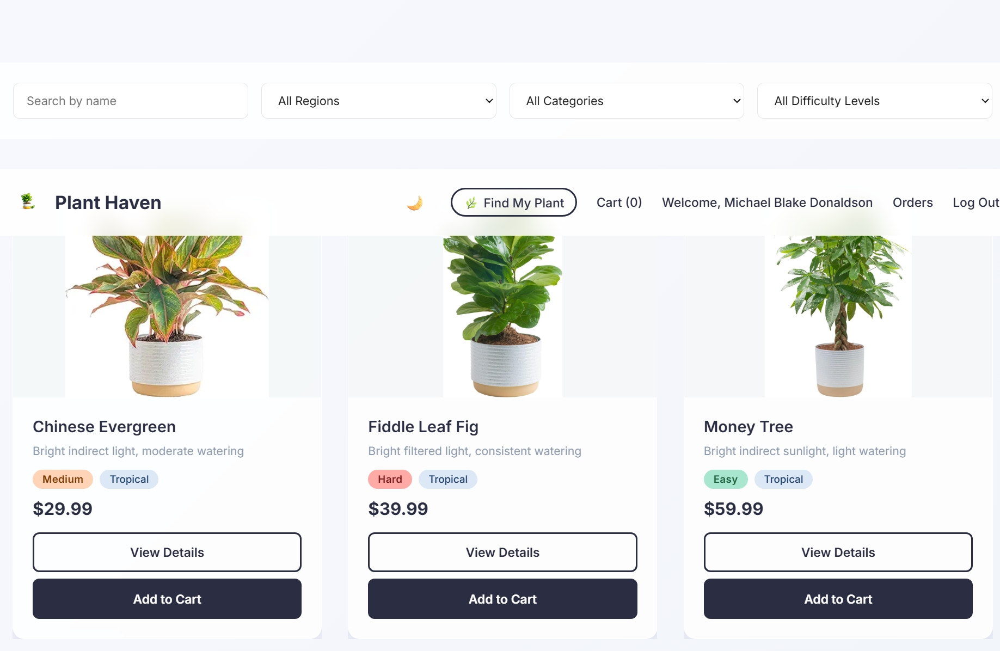
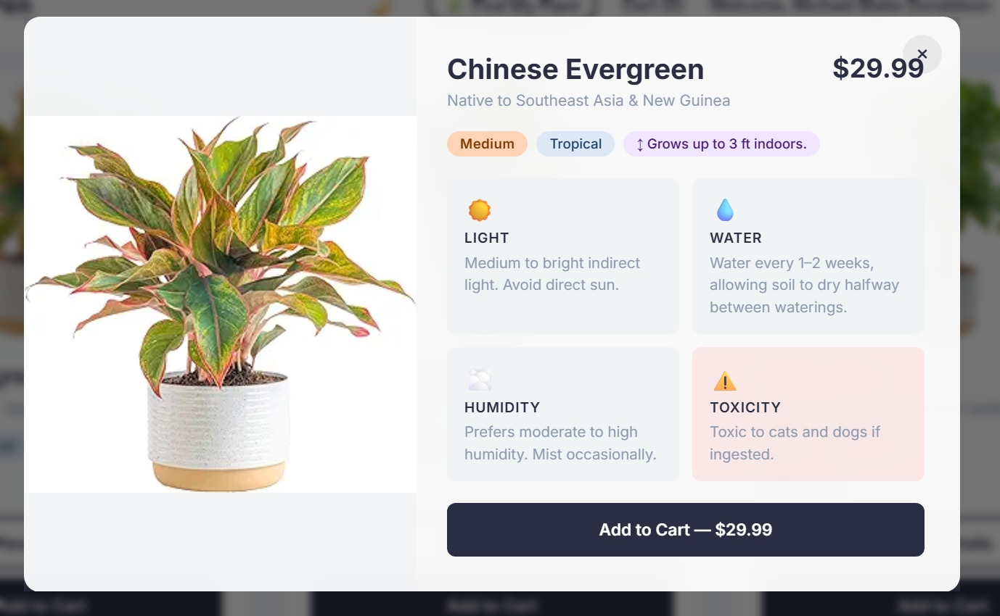
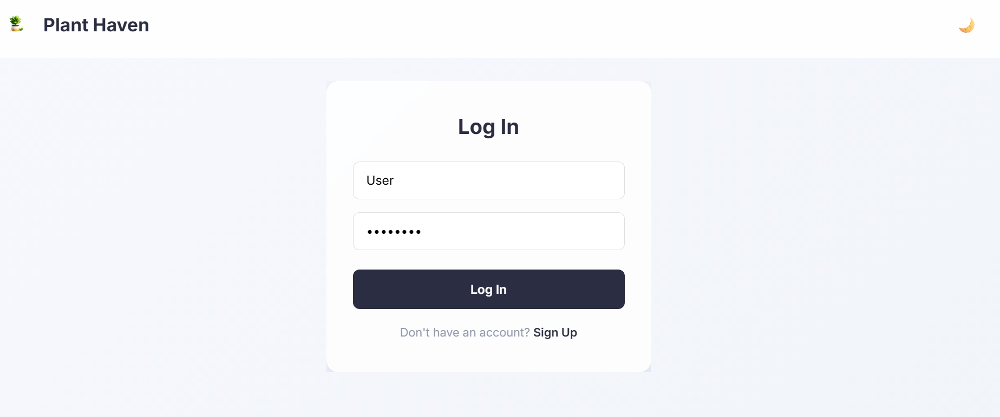
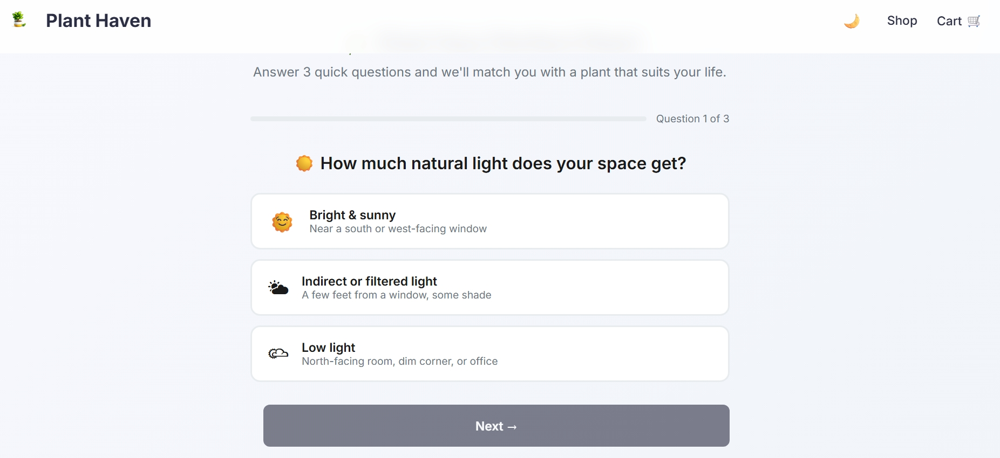

<div align="center">
  

  # Plant Haven

  **A full-stack e-commerce storefront for indoor plant enthusiasts.**  
  Built with vanilla HTML, CSS, and JavaScript — powered by Supabase, Stripe, and Netlify.

  
  

</div>

---

## Screenshots

| Shop | Plant Detail |
|------|-------------|
|  |  |

| Login | Plant Care Quiz |
|-------|----------------|
|  |  |

---

## Features

### 🛍️ Shopping Experience
- **Product Catalog** — browse all plants with name, price, care difficulty, and region badges
- **Live Search & Filters** — filter by name, region, category, and difficulty level; filters sync to the URL so results are shareable and bookmarkable
- **Plant Detail Modal** — click any card to open a full detail overlay with light, water, humidity, toxicity, size, and origin information
- **Wishlist / Favorites** — heart-button on every card saves plants to a persistent localStorage wishlist
- **Recently Viewed Strip** — a horizontal scroll rail automatically tracks and surfaces the last plants you browsed
- **Quantity Selector on Cards** — adjust quantity inline before adding to cart, no extra clicks needed
- **Cart Drawer** — slide-in cart accessible from any page with live item count in the navbar
- **Free Shipping Bar** — progress bar showing how close the cart total is to the free-shipping threshold

### 💳 Checkout & Payments
- **Stripe Checkout** — secure hosted payment page; prices are validated server-side (tamper-proof)
- **Stripe Webhook** — `checkout.session.completed` event writes confirmed orders to Supabase
- **Order History** — authenticated users can view all past orders with date, items, and status
- **Order Confirmation Page** — success page fetches real line-item data from Stripe and displays an itemized receipt

### 🔐 Authentication
- **Supabase Auth** — sign up and log in with email/password; sessions persist across tabs
- **Protected Routes** — cart checkout and order history require a logged-in account
- **Auth-aware Navbar** — shows "Welcome, [Name]", Orders link, and Log Out when signed in; "Log In" when signed out

### 🌿 Plant Care Quiz
- **3-question interactive quiz** — asks about light level, pet/child safety, and watering preference
- **Score-based matching** — plants are ranked by compatibility score and top matches are shown
- **Add to Cart from results** — matched plants can be added directly from the results page

### 🎨 Design & UX
- **Dark mode** — system preference detected on load; toggle persists in localStorage across all pages
- **Skeleton loaders** — content placeholders shown while plant data loads from Supabase
- **Toast notifications** — slide-in feedback for cart actions, wishlist changes, errors, and login prompts
- **Lazy image loading** — plant images use IntersectionObserver to load only when scrolled into view, with a shimmer placeholder
- **Glassmorphism UI** — filter bar and navbar use a frosted-glass effect

### ⚙️ Technical & Infrastructure
- **PWA-ready** — `manifest.json` and service worker (`sw.js`) enable installability and offline caching
- **Netlify Serverless Functions** — `create-checkout`, `get-order`, and `stripe-webhook` run as edge functions
- **Cache-Control headers** — assets cached for 1 year; HTML always revalidated; SW never cached
- **SEO** — Open Graph tags on every page, JSON-LD structured data on the home page, `sitemap.xml`, and `robots.txt`
- **Custom 404 page** — plant-themed not-found page with navigation back to the store
- **Security headers** — `X-Frame-Options`, `X-Content-Type-Options`, `Referrer-Policy`, and `Permissions-Policy` set via `netlify.toml`

---

## Tech Stack

| Layer | Technology |
|-------|-----------|
| Frontend | Vanilla HTML5, CSS3, JavaScript (ES2020+) |
| Auth & Database | [Supabase](https://supabase.com) (Auth + PostgreSQL) |
| Payments | [Stripe](https://stripe.com) Checkout + Webhooks |
| Hosting | [Netlify](https://netlify.com) (Static + Serverless Functions) |
| PWA | Web App Manifest + Service Worker |
| Version Control | Git / GitHub |

---

## Project Structure

```
PlantHaven/
├── home.html              # Main shop / catalog page
├── cart.html              # Shopping cart
├── login.html             # Authentication — log in
├── signup.html            # Authentication — sign up
├── orders.html            # Order history (authenticated)
├── success.html           # Post-checkout confirmation
├── quiz.html              # Plant care quiz
├── 404.html               # Custom not-found page
├── manifest.json          # PWA manifest
├── sw.js                  # Service worker (offline caching)
├── sitemap.xml            # Search engine sitemap
├── robots.txt             # Crawler directives
├── netlify.toml           # Build config, headers, redirects
├── assets/
│   ├── planthavenlogo.png
│   ├── screenshots/       # README screenshots
│   └── *.jpg / *.webp     # Plant product images
├── styles/
│   └── home.css           # Global stylesheet (light + dark themes)
├── javascript/
│   ├── home.js            # Catalog, filters, cart drawer, wishlist, modal
│   ├── cart.js            # Cart page logic + Stripe checkout trigger
│   ├── auth.js            # Supabase auth (login / signup / session)
│   └── supabase-config.js # Supabase client initialization
└── netlify/functions/
    ├── create-checkout.js # Creates Stripe Checkout session (server-side prices)
    ├── get-order.js        # Retrieves order details from Stripe for success page
    └── stripe-webhook.js  # Listens for payment events, writes orders to Supabase
```

---

## Getting Started

### Prerequisites
- [Node.js](https://nodejs.org/) (for Netlify CLI)
- [Netlify CLI](https://docs.netlify.com/cli/get-started/): `npm install -g netlify-cli`
- A [Stripe](https://stripe.com) account (test mode keys)
- A [Supabase](https://supabase.com) project

### Local Setup

```bash
# Clone the repo
git clone https://github.com/Michael-Blake-Donaldson/PlantHaven-Ecommerce_Store.git
cd PlantHaven-Ecommerce_Store

# Install dependencies (for serverless functions)
npm install

# Copy environment variable template
cp .env.example .env
# Fill in your keys in .env

# Start local dev server with Netlify Functions support
netlify dev
```

### Environment Variables

| Variable | Description |
|----------|-------------|
| `STRIPE_SECRET_KEY` | Stripe secret key (from Stripe dashboard) |
| `STRIPE_WEBHOOK_SECRET` | Stripe webhook signing secret |
| `SUPABASE_URL` | Your Supabase project URL |
| `SUPABASE_SERVICE_KEY` | Supabase service role key (server-side only) |

See `.env.example` for the full template.

### Supabase Tables

**`orders`**
| Column | Type | Notes |
|--------|------|-------|
| `id` | uuid | Primary key |
| `session_id` | text | Stripe session ID |
| `customer_email` | text | Buyer email |
| `customer_name` | text | Buyer name |
| `amount_total` | integer | Total in cents |
| `currency` | text | e.g. `usd` |
| `items` | jsonb | Line items array |
| `status` | text | `paid`, `pending` |
| `created_at` | timestamptz | Auto-set |

---

## Deployment

The site deploys automatically to Netlify on every push to `main`.

1. Connect your GitHub repo in the Netlify dashboard
2. Set the environment variables under **Site Settings → Environment Variables**
3. Register your Stripe webhook endpoint: `https://your-site.netlify.app/.netlify/functions/stripe-webhook`
4. Push to `main` — Netlify handles the rest

---

## License

[MIT](./LICENSE) © Michael Blake Donaldson
